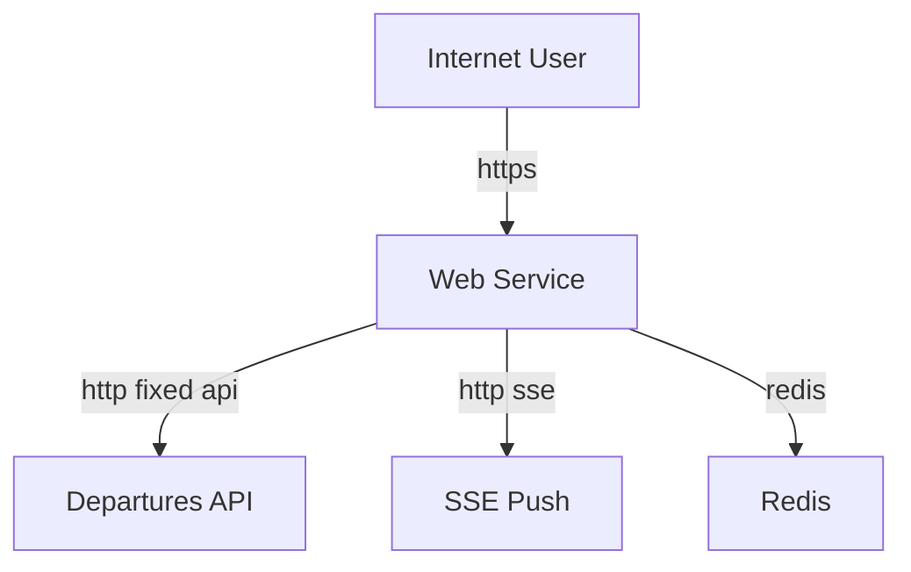

## Executive summary

The `web` service is acting as an internet-exposed edge application for `railsix.com`, with a small set of fixed server-side bridges into Railway-internal services rather than a generic reverse proxy. That is the industry-standard pattern: expose only curated public endpoints at the edge and keep internal service URLs private. Based on the current repo, I did not find a user-controlled path that can turn the `web` service into an arbitrary proxy to Railway-internal hosts. The main security issue in this scope is that `/health` is publicly reachable and returns dependency status derived from internal service checks, which creates unnecessary reconnaissance value. A secondary risk is that the `/api/*` and `/api/sse` routes are intentionally public, so if the goal were “no public path at all from `railsix.com` to internal services,” the current design does not meet that requirement.

## Scope and assumptions

- In-scope paths:
  - `services/web/src`
  - `services/web/railway.toml`
- Out-of-scope:
  - Backend service implementation details in `services/departures-api`, `services/sse-push`, `services/realtime-poller`, `services/gtfs-static`, except where they are invoked by the web service
  - CI, tests, and local-dev-only behavior except where they reveal runtime trust boundaries
- Assumptions:
  - `railsix.com` is the public internet-facing deployment of the `web` service.
  - `API_BASE_URL` and `SSE_PUSH_URL` point to Railway-internal addresses in production.
  - Public users are expected to consume the fixed `web` routes under `/api/*` and `/api/sse`.
  - `/health` does not need to remain public and can be moved to internal-only monitoring.
  - There is no authentication or tenant isolation requirement for public transit data.

Open questions that would materially change the risk ranking:
- Whether `/api/*` should remain public as the intended external API surface, or whether only HTML pages should be public.
- Whether upstream backend error messages are guaranteed to remain non-sensitive in production.

## System model

### Primary components

- `web` SvelteKit server: serves SSR pages, static assets, and fixed backend bridge endpoints under `/api/*` and `/api/sse`. Evidence: `services/web/src/routes`, `services/web/src/lib/server/proxy.ts`, `services/web/src/routes/api/sse/+server.ts`.
- Public request policy in hooks: applies provenance checks, request rate limiting, SSE connection limiting, and response hardening headers. Evidence: `services/web/src/hooks.server.ts`, `services/web/src/lib/server/rate-limit.ts`.
- Internal dependencies:
  - `departures-api` over `API_BASE_URL`
  - `sse-push` over `SSE_PUSH_URL`
  - Redis for rate limiting via `REDIS_URL` or `REDIS_ADDR`/`REDIS_PASSWORD`
  Evidence: `services/web/src/lib/server/proxy.ts`, `services/web/src/lib/server/health.ts`, `services/web/src/lib/server/rate-limit.ts`.
- Railway deployment: single public service process started with `node build/index.js`, healthchecked on `/health`. Evidence: `services/web/railway.toml`.

### Data flows and trust boundaries

- Internet user -> `web` HTML routes
  - Data: URL path, query parameters, cookies/headers
  - Channel: HTTPS to `railsix.com`
  - Security guarantees: browser-to-edge TLS assumed by deployment; no app-layer auth
  - Validation/normalization: SvelteKit routing and page loaders; no special access control for page routes
  - Evidence: `services/web/src/routes/+page.server.ts`, `services/web/src/routes/departures/+page.server.ts`

- Internet user -> `web` fixed API routes under `/api/*`
  - Data: stop codes, query params, SSE requests
  - Channel: HTTPS
  - Security guarantees: provenance checks based on `Origin`/`Referer`/`Sec-Fetch-Site`, IP-based rate limiting, SSE connection limits
  - Validation/normalization: fixed route construction, stop code encoding, timeout-bound upstream fetches
  - Evidence: `services/web/src/hooks.server.ts`, `services/web/src/routes/api/departures/[stopCode]/+server.ts`, `services/web/src/lib/server/proxy.ts`

- `web` -> `departures-api`
  - Data: fixed-path JSON requests for stops, alerts, departures, network health, union departures
  - Channel: server-side HTTP to `API_BASE_URL`
  - Security guarantees: internal URL configured from private env var; no user control of base URL; fixed route set only
  - Validation/normalization: user input limited to stop code path/query composition; no arbitrary URL fetch
  - Evidence: `services/web/src/lib/server/proxy.ts`, `services/web/src/routes/api/alerts/+server.ts`, `services/web/src/routes/api/network-health/+server.ts`, `services/web/src/routes/api/union-departures/+server.ts`, `services/web/src/routes/api/departures/[stopCode]/+server.ts`

- `web` -> `sse-push`
  - Data: fixed-path SSE stream
  - Channel: server-side HTTP streaming to `SSE_PUSH_URL`
  - Security guarantees: internal URL configured from private env var; fixed `/sse` path only; request abort propagated
  - Validation/normalization: timeout on setup, no user-controlled URL components
  - Evidence: `services/web/src/routes/api/sse/+server.ts`, `services/web/src/lib/server/proxy.ts`

- `web` -> Redis
  - Data: rate-limit counters and SSE connection counters keyed by client IP
  - Channel: server-side Redis connection
  - Security guarantees: private env-based connection string; fallback to in-memory limiter if Redis is unavailable
  - Validation/normalization: keys are app-generated, not user-supplied
  - Evidence: `services/web/src/lib/server/rate-limit.ts`

- Internet user -> `web` `/health`
  - Data: unauthenticated GET request
  - Channel: HTTPS
  - Security guarantees: none beyond normal route handling
  - Validation/normalization: route triggers internal health fetches to backend services and returns summary
  - Evidence: `services/web/src/routes/health/+server.ts`, `services/web/src/lib/server/health.ts`, `services/web/railway.toml`

#### Diagram

## Assets and security objectives

| Asset | Why it matters | Security objective (C/I/A) |
| --- | --- | --- |
| Railway-internal service URLs and reachability | Internal topology should not become a user-controlled pivot or reconnaissance target | C / A |
| Availability of `departures-api` and `sse-push` | Public users depend on timely transit data and SSE updates | A |
| Edge routing integrity | The `web` service defines what backend capabilities are exposed publicly | I |
| Rate-limit state in Redis | Prevents abuse of the public edge and protects internal dependencies | I / A |
| Dependency health state | Reveals internal backend availability and partial topology when exposed externally | C |
| Production env-configured service endpoints | Control which internal systems the web tier can reach | C / I |

## Attacker model

### Capabilities

- Unauthenticated remote attacker on the public internet can send arbitrary HTTPS requests to `railsix.com`.
- Attacker can spoof browser-like headers (`Origin`, `Referer`, `Sec-Fetch-Site`) in non-browser clients.
- Attacker can open repeated API and SSE connections subject to the app’s rate limiting behavior.
- Attacker can observe response bodies, status codes, cache headers, and timing differences.

### Non-capabilities

- Attacker cannot directly choose arbitrary upstream hosts or base URLs for server-side fetches from the `web` service based on current code.
- Attacker cannot directly reach Railway `.internal` hosts unless the `web` service exposes an explicit path to them.
- Attacker is not assumed to have shell, deploy, or environment-variable control.
- Attacker is not assumed to have authenticated user context because the public app appears anonymous.

## Entry points and attack surfaces

| Surface | How reached | Trust boundary | Notes | Evidence (repo path / symbol) |
| --- | --- | --- | --- | --- |
| `/` and SSR pages | Public HTTPS | Internet -> Web | Server-side page loaders fetch backend data | `services/web/src/routes/+page.server.ts`, `services/web/src/routes/departures/+page.server.ts` |
| `/api/alerts` | Public HTTPS | Internet -> Web -> `departures-api` | Fixed-path proxy; no user-controlled upstream URL | `services/web/src/routes/api/alerts/+server.ts`, `services/web/src/lib/server/proxy.ts` |
| `/api/network-health` | Public HTTPS | Internet -> Web -> `departures-api` | Fixed-path proxy | `services/web/src/routes/api/network-health/+server.ts`, `services/web/src/lib/server/proxy.ts` |
| `/api/union-departures` | Public HTTPS | Internet -> Web -> `departures-api` | Fixed-path proxy | `services/web/src/routes/api/union-departures/+server.ts`, `services/web/src/lib/server/proxy.ts` |
| `/api/departures/{stopCode}` | Public HTTPS | Internet -> Web -> `departures-api` | User controls stop code and optional `dest`, not upstream host/path family | `services/web/src/routes/api/departures/[stopCode]/+server.ts` |
| `/api/sse` | Public HTTPS | Internet -> Web -> `sse-push` | Fixed-path SSE bridge with timeout and per-IP connection caps | `services/web/src/routes/api/sse/+server.ts`, `services/web/src/lib/server/rate-limit.ts` |
| `/health` | Public HTTPS | Internet -> Web -> internal health checks | Reveals backend dependency state to unauthenticated users | `services/web/src/routes/health/+server.ts`, `services/web/src/lib/server/health.ts`, `services/web/railway.toml` |
| Redis-backed rate limiter | Indirect via any `/api/*` or `/api/sse` request | Web -> Redis | Abuse of edge can still pressure limiter state and fallback mode | `services/web/src/lib/server/rate-limit.ts` |

## Top abuse paths

1. Attacker probes public `/health` -> receives dependency state for `api` and `ssePush` -> uses outages or error strings to map internal failure conditions -> improves timing and targeting of follow-on abuse.
2. Attacker sends high-volume requests to fixed `/api/*` routes -> `web` repeatedly fans those into internal `departures-api` requests -> internal service capacity is consumed through the intended public bridge.
3. Attacker opens repeated `/api/sse` streams -> `web` opens matching upstream SSE connections to `sse-push` -> connection slots and backend stream resources are consumed.
4. Attacker spoofs browser provenance headers -> bypasses the intended “browser-only” API policy in hooks -> uses scripts or bots to hit public API routes at scale.
5. Attacker abuses stop-code parameter space on `/api/departures/{stopCode}` -> uses the public edge as an oracle for backend behavior, status codes, and cacheability -> performs route enumeration and targeted DoS without needing internal host access.
6. Attacker induces backend errors on fixed routes -> proxy surfaces upstream status and body text -> potentially learns implementation details from internal services if those error bodies become verbose in future.

## Threat model table

| Threat ID | Threat source | Prerequisites | Threat action | Impact | Impacted assets | Existing controls (evidence) | Gaps | Recommended mitigations | Detection ideas | Likelihood | Impact severity | Priority |
| --- | --- | --- | --- | --- | --- | --- | --- | --- | --- | --- | --- | --- |
| TM-001 | Internet attacker | Public access to `railsix.com` | Query `/health` to learn backend dependency state and error conditions | Reconnaissance against internal topology and outage state | Dependency health state, internal service reachability | No auth, simple JSON health route (`services/web/src/routes/health/+server.ts`, `services/web/src/lib/server/health.ts`) | Public route exposes internal dependency summary; Railway healthcheck also points at `/health` (`services/web/railway.toml`) | Move health monitoring to internal-only URL or internal service domain; return only edge self-health on public route; split public liveness from internal dependency readiness | Alert on public `/health` hits; log caller IP and UA; compare external hit volume with monitoring system IDs | high | medium | high |
| TM-002 | Internet attacker | Public access to `/api/*` | Abuse fixed API routes to drive load into `departures-api` | Availability degradation of backend through intended edge bridge | Availability of `web`, `departures-api` | IP rate limiting in hooks and Redis-backed counters (`services/web/src/hooks.server.ts`, `services/web/src/lib/server/rate-limit.ts`) | Public API remains intentionally reachable; no per-route adaptive quotas or backend-aware circuit breaking visible in `web` | Add tighter per-route budgets, backend error budget shedding, cache hot responses aggressively at the edge, and add monitoring on 429/5xx spikes | Track per-route request rate, upstream latency, 429s, and dependency 5xx bursts | medium | medium | medium |
| TM-003 | Internet attacker | Ability to spoof headers | Send non-browser scripted requests with fake `Origin` / `Referer` / `Sec-Fetch-Site` | Circumvent “browser-only” policy and automate public API abuse | Edge routing policy integrity, backend availability | Provenance checks in hooks (`services/web/src/hooks.server.ts`) | Checks are not authentication and are spoofable by non-browser clients | Treat hooks provenance logic as CSRF/noise reduction only; if non-public API access is desired, add real auth or signed requests; otherwise document these routes as public | Log mismatches between UA patterns and provenance headers; watch scripted hit patterns | high | low | medium |
| TM-004 | Internet attacker | Public access to `/api/sse` | Open many SSE streams to force matching upstream streams to `sse-push` | Streaming resource exhaustion on web or SSE backend | Availability of `web`, `sse-push` | SSE per-IP max of 3, abort handling, timeout on setup (`services/web/src/hooks.server.ts`, `services/web/src/lib/server/rate-limit.ts`, `services/web/src/routes/api/sse/+server.ts`) | Protection is IP-based and may be weaker against distributed sources or NAT crowding; no auth on streams | Add global concurrent SSE caps, per-ASN or per-network heuristics, and backend-side connection monitoring | Monitor SSE open count, per-IP saturation, upstream disconnect/error rates | medium | medium | medium |
| TM-005 | Internet attacker | Public access to fixed proxy routes | Trigger backend error responses and inspect reflected messages/status codes | Information disclosure if upstream error text becomes verbose or sensitive | Internal service implementation details | Fixed upstream destinations only (`services/web/src/lib/server/proxy.ts`) | `proxyFetch` throws with upstream body text, which can be returned to callers by endpoint handling | Sanitize upstream error bodies before returning them to clients; keep detailed errors in logs only | Alert on non-2xx upstream bodies and capture sanitized vs raw forms in internal logs | medium | low | low |
| TM-006 | Internet attacker | Public access to page routes | Use page SSR loads as an alternative path to trigger backend fetches even without `/api/*` | Additional backend load path via HTML rendering | Availability of `web`, `departures-api` | SSR page loaders are fixed and narrow (`services/web/src/routes/+page.server.ts`, `services/web/src/routes/departures/+page.server.ts`) | Same backend dependencies are reachable through page rendering; no explicit edge caching visible in scope | Add response caching for SSR where acceptable and track backend fetch cost per page render | Monitor SSR page render latency and backend call fanout | low | medium | low |

## Criticality calibration

For this repo and context:

- `critical`
  - A user-controlled path that turns `web` into an arbitrary proxy to Railway-internal hosts or arbitrary URLs.
  - Exposure of credentials or secrets from env-backed internal service configuration.
  - A bypass that allows direct access to unintended privileged backend operations through `web`.

- `high`
  - Public exposure of internal dependency state that materially improves attacker targeting or outage discovery.
  - A practical public path that lets attackers drive significant backend load through the edge beyond intended usage.
  - A path that discloses internal topology or sensitive operational details at scale.

- `medium`
  - Abuse paths that degrade backend availability but are constrained by edge controls or fixed route design.
  - Weak policy controls that look like access controls but are only advisory, such as spoofable provenance checks.
  - Public streaming or polling routes that can be abused with measurable but bounded operational cost.

- `low`
  - Small information leaks from status codes or narrow fixed-route errors without secret disclosure.
  - Additional intended backend reachability through SSR pages when it does not expand capability.
  - Noisy scanning hits that do not cross trust boundaries or affect internal routing.

## Focus paths for security review

| Path | Why it matters | Related Threat IDs |
| --- | --- | --- |
| `services/web/src/hooks.server.ts` | Central gate for provenance checks, rate limiting, SSE admission, and response hardening | TM-002, TM-003, TM-004 |
| `services/web/src/lib/server/proxy.ts` | Defines whether fixed backend bridging can become arbitrary proxying and how upstream errors are surfaced | TM-002, TM-005 |
| `services/web/src/routes/api/departures/[stopCode]/+server.ts` | Only user-parameterized API bridge and therefore the most important fixed-route input surface | TM-002, TM-005 |
| `services/web/src/routes/api/sse/+server.ts` | SSE bridge to internal service with long-lived connection behavior | TM-004 |
| `services/web/src/lib/server/rate-limit.ts` | Abuse control state, Redis fallback behavior, and SSE concurrency accounting live here | TM-002, TM-004 |
| `services/web/src/routes/health/+server.ts` | Public health endpoint is the clearest unintended exposure candidate | TM-001 |
| `services/web/src/lib/server/health.ts` | Contains the internal dependency checks and the data returned to callers | TM-001 |
| `services/web/railway.toml` | Deployment config currently binds Railway health checks to a public path | TM-001 |

## Quality check

- Covered all discovered runtime entry points in scope: page SSR routes, `/api/*`, `/api/sse`, and `/health`.
- Represented each trust boundary in at least one threat: internet to web, web to backend API, web to SSE backend, web to Redis.
- Kept runtime behavior separate from tests and development-only configuration.
- Reflected user clarifications: `railsix.com` is public, `/health` is not desired to be public, and the concern is exposure of backend services through the web tier.
- Assumptions and open questions are explicit.
